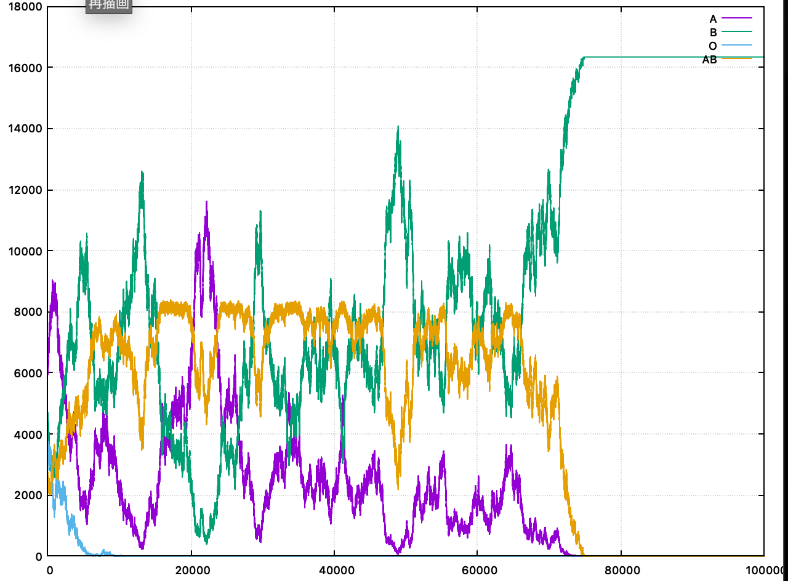
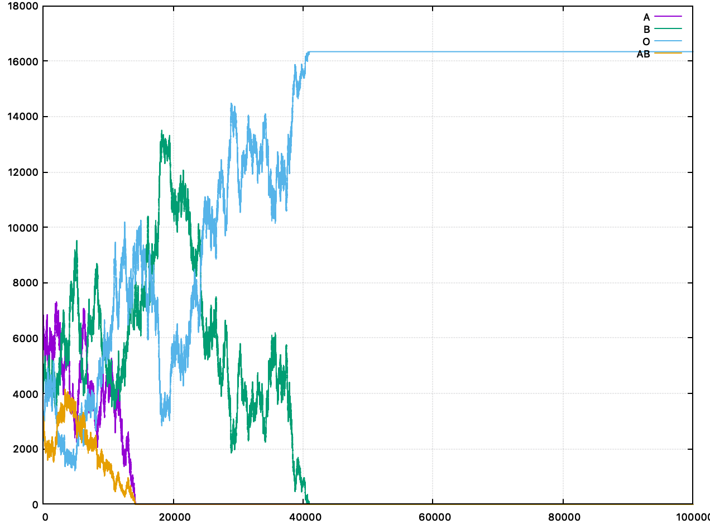
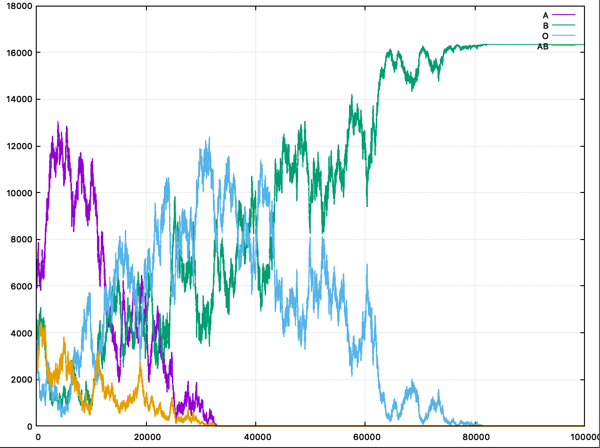

# ABO式血液型の個体数推移シミュレーション

## 設定

* ABOの3種類の遺伝子を2つ持ち、その組み合わせによってA・B・O・ABの4つの発現形がある
* AとBが顕性、Oが潜性

## 使い方

個体数1万、A:B:O:AB=4:3:2:1の初期値で10万世代シミュレーションする例

```sh
$ cargo build --release
$ ./target/release/abo 10000 4 3 2 1 100000 > data/4_5_0.dat
```

## 結果




